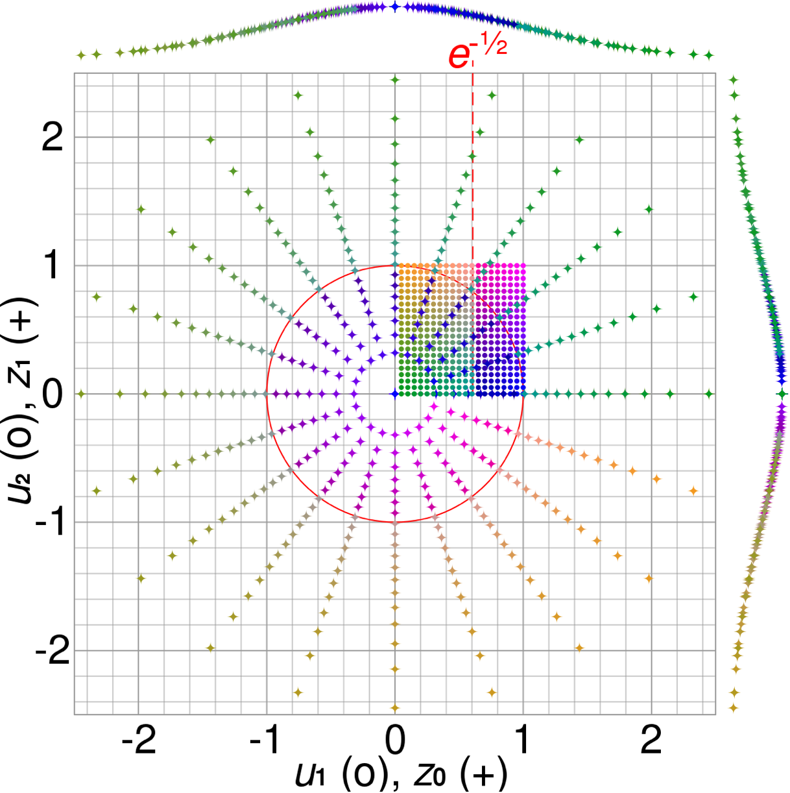
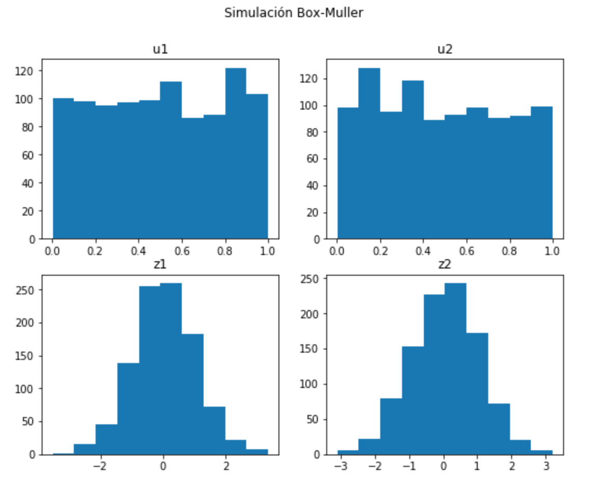

# Algoritmo Box-Müller
Simulación de variables aleatorias con distribución normal estándar (Algoritmo Box-Müller).

La transformada Box-Muller, de George Edward Pelham Box y Mervin Edgar Muller, [1] es un método de muestreo de números aleatorios para generar pares de números aleatorios independientes, estándar, normalmente distribuidos (expectativa cero, varianza unitaria), dada una fuente de números aleatorios distribuidos. De hecho, el método fue mencionado explícitamente por primera vez por Raymond E. A. C. Paley y Norbert Wiener en 1934. (ver https://en.wikipedia.org/wiki/Box–Muller_transform).



Visualización de la transformada Box-Muller: los puntos coloreados en el cuadrado unitario (u1, u2), dibujados como círculos, se asignan a un gaussiano 2D (z0, z1), dibujados como cruces. Las gráficas de los márgenes son las funciones de distribución de probabilidad de z0 y z1 (ver https://upload.wikimedia.org/wikipedia/commons/1/1f/Box-Muller_transform_visualisation.svg). 

## Algoritmo
```
import numpy as np

def simulaNormalE(n = 1000):
    """ Función para simular variables aleatorias
        con el algoritmo de Box-Muller. """
    
    # Obtenemos variables aleatorias distribuidas uniformementes en (0,1]
    u1 = np.random.rand(n)
    u2 = np.random.rand(n)
    
    # Aplicamos la transformacion
    w1 = np.sqrt(-2 * np.log(u1))
    w2 =  2 * np.pi * u2
    z1 = w1 * np.cos(w2)
    z2 = w1 * np.sin(w2)
    
    # Devolvemos los resultados
    return(z1,z2,u1,u2)
```

## Resultados


